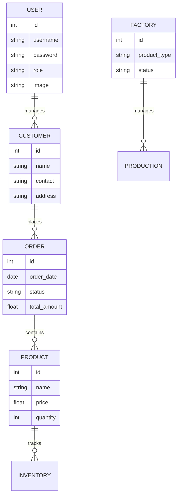

# مخطط قاعدة البيانات

## تفاصيل الجداول

### USER (المستخدمين)
- id: معرف المستخدم
- username: اسم المستخدم
- password: كلمة المرور (مشفرة)
- role: الدور (مدير، موظف، الخ)
- image: صورة المستخدم

### CUSTOMER (العملاء)
- id: معرف العميل
- name: اسم العميل
- contact: معلومات الاتصال
- address: العنوان

### ORDER (الطلبات)
- id: معرف الطلب
- order_date: تاريخ الطلب
- status: حالة الطلب
- total_amount: المبلغ الإجمالي

### PRODUCT (المنتجات)
- id: معرف المنتج
- name: اسم المنتج
- price: السعر
- quantity: الكمية المتوفرة

### FACTORY (المصنع)
- id: معرف المصنع
- product_type: نوع المنتج
- status: حالة الإنتاج

### INVENTORY (المخزون)
- product_id: معرف المنتج
- quantity: الكمية
- last_updated: آخر تحديث

### PRODUCTION (الإنتاج)
- id: معرف الإنتاج
- factory_id: معرف المصنع
- status: حالة الإنتاج
- start_date: تاريخ البدء
- end_date: تاريخ الانتهاء المتوقع
