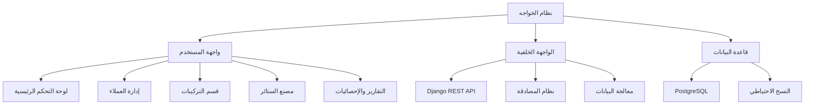

# نظام إدارة العملاء - الخواجه
## هيكل النظام

## التقنيات المستخدمة

### الواجهة الخلفية:
- Django 4.x
- Django REST framework
- Celery للمهام الخلفية
- Redis للتخزين المؤقت

### الواجهة الأمامية:
- Bootstrap 5
- JavaScript/jQuery
- Chart.js للرسوم البيانية
- DataTables للجداول التفاعلية

### قاعدة البيانات:
- PostgreSQL
- نظام نسخ احتياطي تلقائي

### الأمان:
- JWT للمصادقة
- CSRF protection
- تشفير البيانات الحساسة
